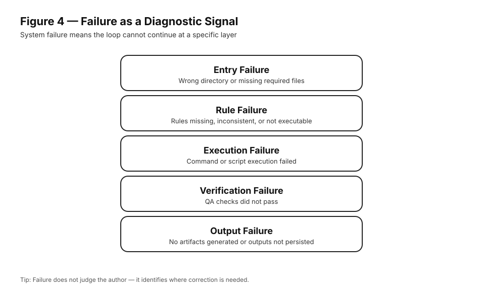

# Chapter 6｜When the System Says “Fail”

> 🌏 **中文版本：**  
> 请参见 [`docs/book/ch06-when-the-system-says-fail.md`](../book/ch06-when-the-system-says-fail.md)

Failure in this system is not an exception.

Chapter 6｜When the System Says “Fail”

(International Edition – Failure as Boundary Feedback)

🌏 中文版本：
请参见 docs/book/ch06-when-the-system-says-fail.md

Failure in this system is not an exception.
It is an expected outcome.

> **Figure 4 — Failure as a Diagnostic Signal**  
> When the system returns *fail*, it is not rejecting the author.  
> It precisely identifies the layer where the publishing loop cannot proceed.

In fact, a system that never fails
cannot reliably confirm completion.

This chapter explains what “fail” means,
and how to respond when the system refuses to proceed.

What “fail” actually means

When the system says “fail,” it is not judging you.

It is asserting a boundary.

Specifically, it means that at least one required condition
for completion has not been met.

Nothing more.
Nothing less.

Why failure must stop the loop

In Route A, failure is a hard stop.

This is intentional.

If the system were allowed to continue after a failure,
completion would become ambiguous again.

A system that can be bypassed
cannot be trusted.

Common failure signals

Failures typically appear as:

a failed QA step

a blocked build

a missing or invalid output

In each case, the message is the same:

Completion has not occurred yet.

The system does not ask you to explain.
It asks you to correct.

The correct response to failure

When the system fails, do exactly three things:

Stop.
Do not continue executing commands.

Read the failure message.
Do not skim. Do not guess.

Fix the minimum required issue.
Change only what the system reports.

Then rerun the system.

Nothing else is required.

What not to do when the system fails

The following responses are explicitly invalid:

explaining why it “should have passed”

bypassing the failing step

modifying outputs by hand

providing screenshots or assurances

These actions reintroduce interpretation,
which Route A is designed to eliminate.

Failure is not regression

A failed run does not erase progress.

It simply means that completion
has not yet been confirmed.

This distinction matters.

Failure happens before completion,
not after.

There is no loss—only delay.

Why failure makes teaching possible

In teaching environments, failure is essential.

It allows:

consistent grading

fair evaluation

clear expectations

Students are not judged by persuasion.
They are evaluated by system outcomes.

This removes most conflict
from assessment.

Failure in collaborative settings

In teams, failure serves the same purpose.

It prevents premature claims of completion
and forces alignment around shared criteria.

No one needs to argue.

The system has already answered.

What to carry forward

If you remember only one thing from this chapter,
remember this:

Failure is the system protecting the meaning of completion.

Once you accept that role,
failure becomes useful instead of frustrating.
