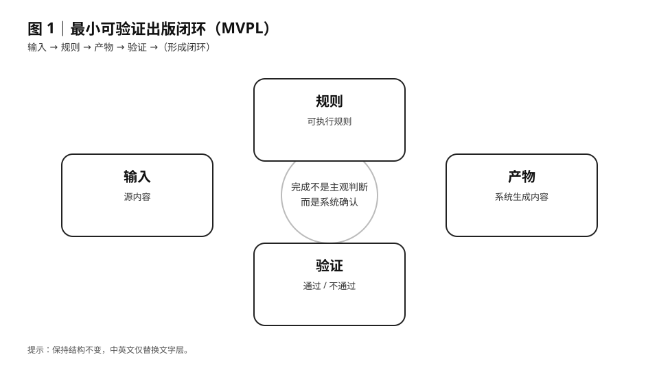

> 🌐 **English version available:**  
> See [`docs/book-en/ch03-mvpl-minimum-verifiable-publishing-loop.md`](../book-en/ch03-mvpl-minimum-verifiable-publishing-loop.md)

第 3 章｜MVPL：最小可验证出版闭环

如果完成必须被证明，那么就必须有一个最小、稳定、可重复的证明结构。

3.1 为什么我们需要一个“最小闭环”

在前两章中，我们已经确认了两件事：

写完，不等于完成

完成，必须是系统事实

但问题随之而来：

系统凭什么证明“完成”？

如果证明结构本身太复杂、太昂贵、
或者依赖大量前置知识，
那么它就会立刻失效。

因为大多数写作者会在第一步就放弃。

这正是“最小”的意义所在。

3.2 MVPL 的定义

> **图 1｜最小可验证出版闭环（MVPL）**  
> 出版是否完成，不取决于写作者的主观判断，  
> 而取决于系统是否基于可执行规则生成产物并完成验证。

MVPL，是本书提出的核心方法论：

MVPL（Minimum Verifiable Publishing Loop）
指的是：
一个用最小步骤、最少规则，
就能生成“可被系统验证的出版结果”的闭环结构。

它不是工具名，
不是平台名，
而是一种完成标准的设计方法。

3.3 为什么一定要是“最小”

很多失败的系统，
并不是因为目标太高，
而是因为起点太重。

常见的错误包括：

一开始就追求完美流程

把所有可能情况都纳入规则

试图一步到位解决所有问题

结果往往是：

系统还没开始用，就已经维护不动了。

MVPL 刻意反其道而行。

它只回答一个问题：

在不引入复杂度的前提下，
能不能证明“出版已经完成”？

3.4 一个出版闭环必须包含的四个要素

无论工具、平台、语言如何变化，
一个可验证的出版闭环，
都必须同时具备以下四个要素：

1️⃣ 输入（Input）

明确存在的源内容

不依赖口头说明

可以被系统读取

2️⃣ 规则（Rules）

可执行

可重复

不依赖个人经验

规则的作用不是限制创作，
而是定义完成边界。

3️⃣ 输出（Output）

明确生成的产物

不是“状态”，而是“文件”

可以被保存、复制、传递

4️⃣ 验证（Verification）

不依赖作者本人

不需要额外解释

第三方可独立复现

只要缺少其中任何一个，
完成就会重新退化为感觉。

3.5 MVPL 与常见“完成模型”的区别

你可能会觉得 MVPL 听起来有点像：

MVP（最小可行产品）

CI（持续集成）

TDD（测试驱动开发）

它们确实有相似之处，
但关注点并不相同。

MVP 关注：是否值得做

CI 关注：是否持续可交付

TDD 关注：是否按规则实现

而 MVPL 只关注一件事：

是否已经完成出版。

它不评估价值，
不评估质量，
只判定：完成 / 未完成。

3.6 为什么 MVPL 对写作者是解放，而不是束缚

很多写作者会本能地担心：

“规则会不会限制我的创作？”

但 MVPL 的规则不介入创作本身。

它既不规定你写什么，
也不规定你怎么写。

它只在最后问一句：

现在，是否可以被系统判定为完成？

一旦这个问题被外包给系统，
写作者反而获得了真正的自由。

3.7 本章小结：完成，是一种可设计的结构

这一章，我们确立了一个核心认知：

完成不是一种感觉，
而是一种可以被设计的结构。

MVPL，就是这种结构的最小实现。

接下来的章节，我们将把 MVPL
第一次落地为一个真实可运行的闭环，
让你亲眼看到：

完成，如何被系统直接判定。
